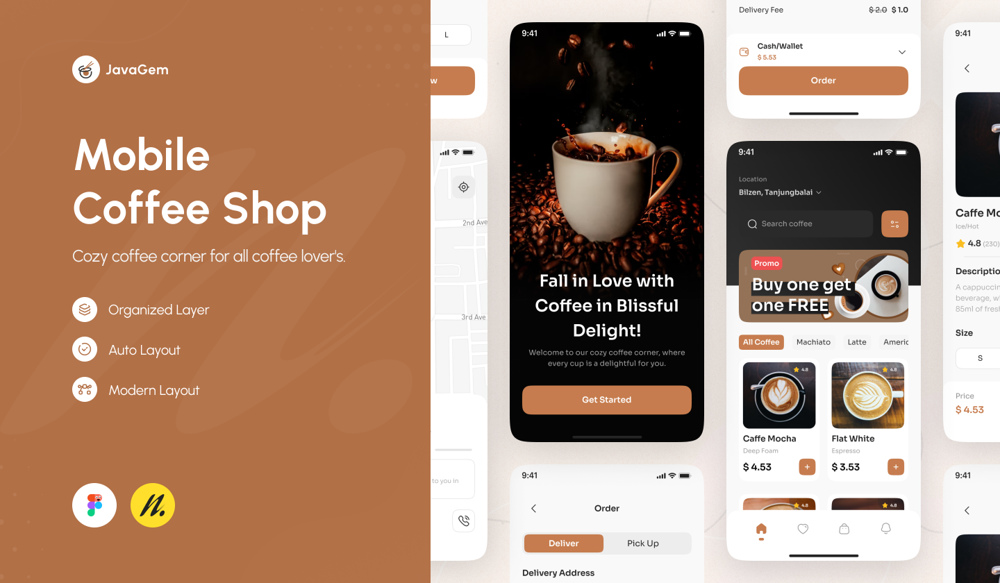
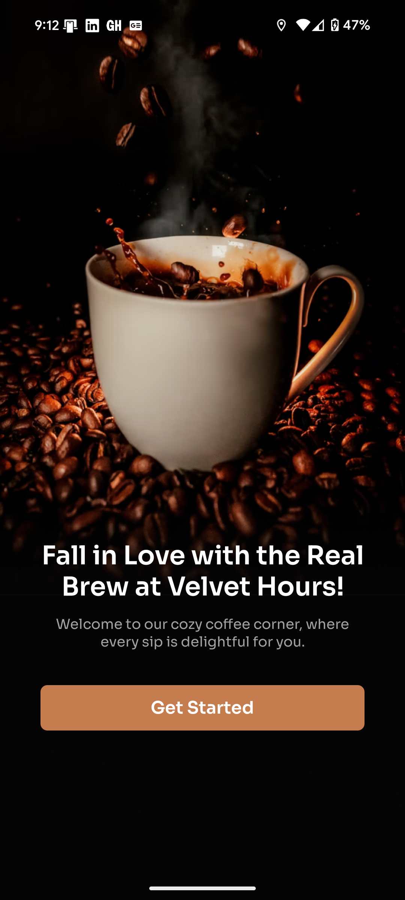
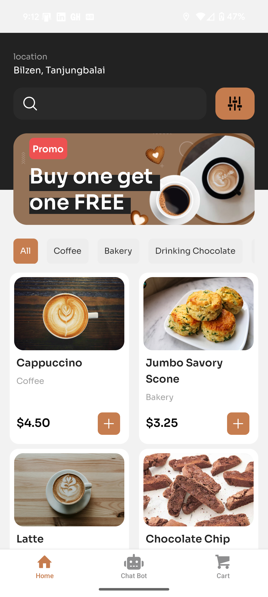
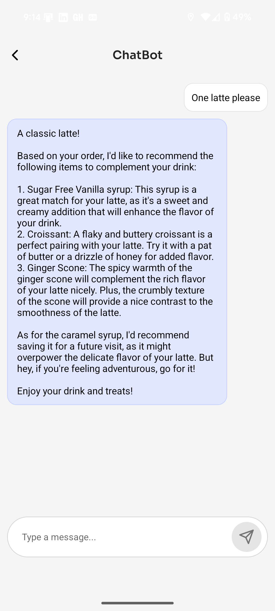
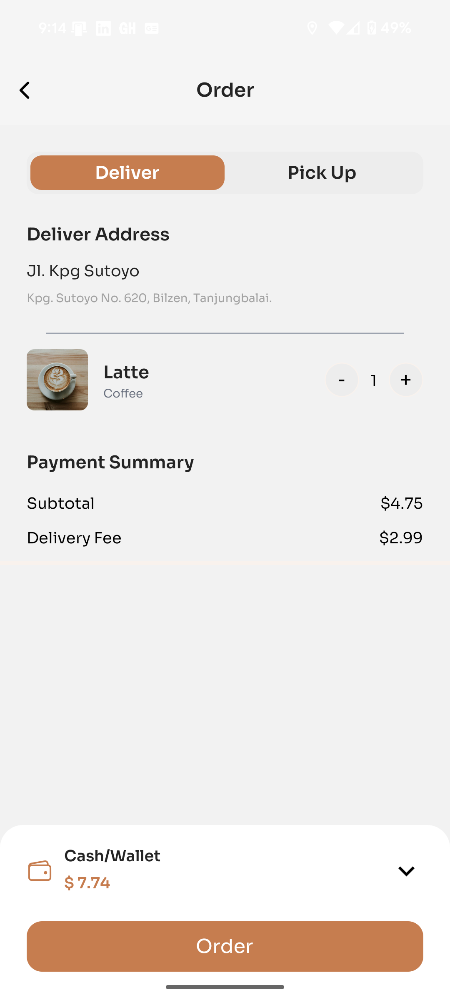
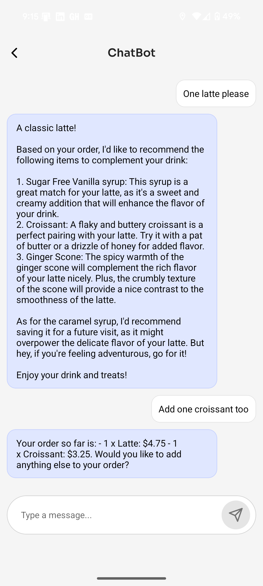
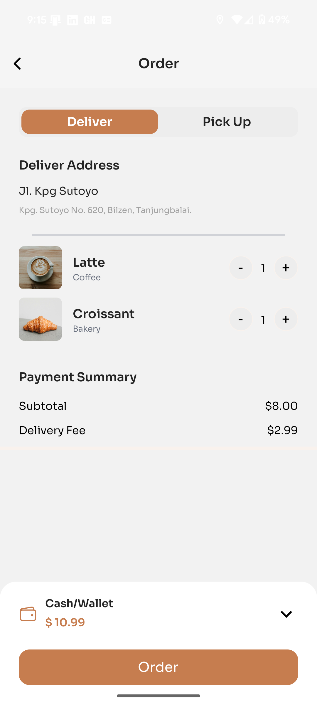
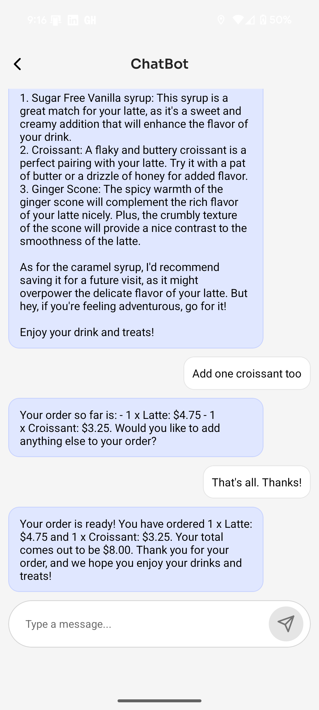

# ☕ Coffee Shop Customer Service Chatbot

This project brings together a fully agent-based AI chatbot designed to improve the customer experience in a mobile coffee shop application. Powered by LLMs, Retrieval-Augmented Generation (RAG), and recommendation systems, the chatbot allows users to ask about menu items, place orders, and get personalized suggestions — all through a smooth React Native interface.

## 🚀 Features

- 📱 **Mobile App (React Native)** – Clean, modern UI with screens for browsing, cart management, and real-time chatbot interaction.
- 🛒 **Chatbot-Linked Cart** – The chatbot can add items directly to the cart, which updates in real time during the conversation.
- 🤖 **Multi-Agent Chatbot** – Handles real-time queries with specialized agents for ordering, recommendations, and FAQs.
- 📚 **RAG-Powered Responses** – Answers detailed menu questions using Retrieval-Augmented Generation and vector search.
- 🎯 **Smart Recommendations** – Uses market basket analysis to suggest products and upsell during order flow.
- 🔒 **Safe Interactions** – Guard Agent filters out irrelevant or harmful queries for a safe and focused experience.

## 🛠️ Tech Stack

<table>
  <tr>
    <td valign="top" width="60%">

<h3>🔧 Backend / AI</h3>

<ul>
  <li>RunPod (LLM hosting)</li>
  <li>Meta-LLaMA via Hugging Face</li>
  <li>OpenAI API (LLM interface)</li>
  <li>Pinecone (RAG vector database)</li>
  <li>Firebase (real-time data)</li>
  <li>Scikit-learn (recommendation engine)</li>
  <li>Pandas (data ops)</li>
  <li>Docker + DockerHub (agent deployment)</li>
</ul>

</td>
<td valign="top" width="50%">

<h3>📱 Mobile App</h3>

<ul>
  <li>React Native + Expo</li>
  <li>TypeScript</li>
  <li>NativeWind (TailwindCSS for React Native)</li>
  <li>Node.js</li>
</ul>

</td>
  </tr>
</table>

## 🔧 What I Learned

Through this project, I gained hands-on experience in:

- Deploying a personal LLM using RunPod infrastructure  
- Designing an agent-based system with specialized agents (Order Taking, Details, Guard, etc.)  
- Setting up and querying a vector database for semantic search over menu data  
- Implementing a Retrieval-Augmented Generation (RAG) pipeline for precise, contextual responses  
- Training and integrating a market basket recommendation engine  
- Building and styling a React Native mobile app with real-time chatbot integration

## 🤖 Chatbot Agent Architecture

The chatbot is built using a modular, agent-based architecture, where each agent is responsible for a specific task. This design enables the system to delegate complex actions to specialized agents, making it flexible, scalable, and easy to extend.

### 🔑 Key Agents

- **🛡️ Guard Agent** – Filters incoming user queries and blocks unsafe or irrelevant ones.
- **📝 Order Taking Agent** – Guides users through structured order placement with chain-of-thought prompts.
- **📚 Details Agent (RAG)** – Answers questions about ingredients, allergens, etc., using vector search + LLMs.
- **🎯 Recommendation Agent** – Suggests complementary items based on the user’s cart.
- **📊 Classification Agent** – Determines intent and routes the query to the appropriate agent.

### ⚙️ How They Work Together

1. **User message** is first passed through the **Guard Agent**
2. If allowed, the **Classification Agent** detects intent
3. Routed to one of:
   - **Order Agent** (which may call the Recommendation Agent)
   - **Details Agent** (for menu lookups)
   - **Recommendation Agent** directly (if needed)

## 📱 React Native Coffee Shop App

The mobile app serves as the user-facing interface for customers to interact with the AI-powered chatbot and explore the coffee shop menu. Designed with a clean and intuitive user experience, the app integrates the chatbot seamlessly for real-time assistance.

### 🧩 Key Screens

- **🏠 Landing Page** – Welcomes users into the app and sets the tone for the coffee shop experience.
- **📋 Home Page** – Displays featured menu items and product categories.
- **📦 Item Details Page** – Shows descriptions, ingredients, allergens, and images.
- **🛒 Cart Page** – Allows users to review/edit their order (including chatbot-synced updates).
- **💬 Chatbot Interface** – Embedded chat window for conversational ordering and FAQs.

## 📸 Live Demo Snapshots

A quick look at the app during local testing:

  
  
  
  
  
  
  

## 🧪 Getting Started

The project is modular, and each folder includes its own setup steps. This allows the frontend, backend, and data pipelines to be deployed independently.

### 🧩 References

- UI inspired by this [Coffee Shop Mobile App Design on Figma](https://www.figma.com/design/PKEMJtsntUgQcN5xAIelkx/Coffee-Shop-Mobile-App-Design--Community-?node-id=421-1221&t=pVDlmECRgUOTj7xk-0)

